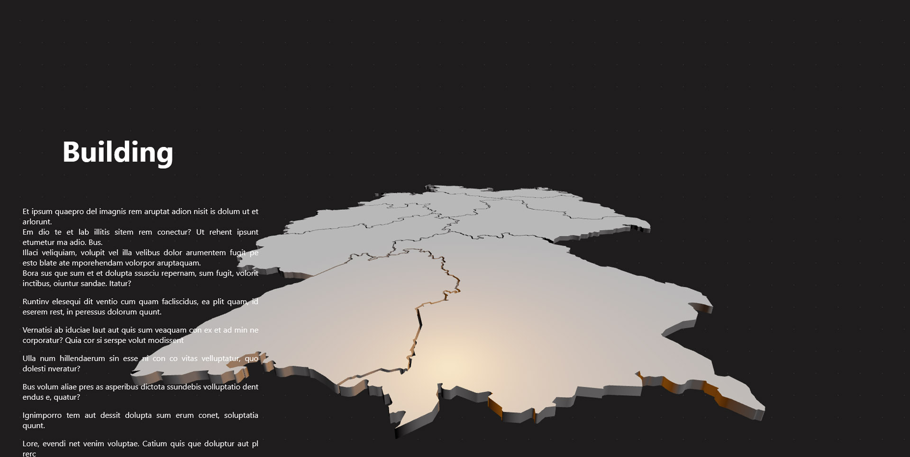

# Building Viewer

## Welcome! 👋

This project is still in development!

An application created to facilitate the presentation of 3d objects such as outdoor constructions.

This application loads a json file that shows the 3d object in gltf as well as the different instances and their point clouds.

In the project configuration you can choose the primary and secondary color and they will be automatically applied to the texts but also to the 3d objects without having to manually edit the gltf.

I can't wait to see the final result